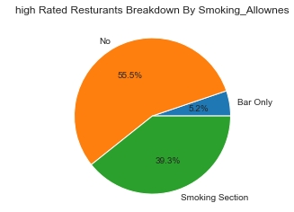
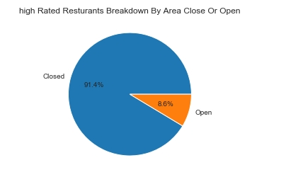
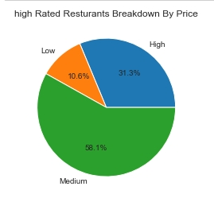
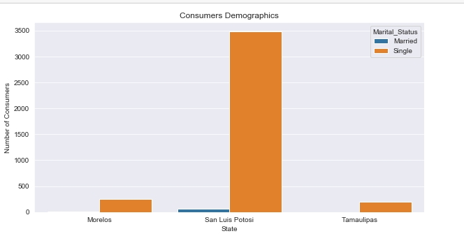

# Introduction

 ## Restaurants Rating data analysis project :
 ####  The Data Set Shows Resturants Ratings In Mexico.
 #### The main reason For the analysis is To detect the high Rating Restaurants and The reason They got high ratings. 
#
 # Questsions  :
 
   - Q1 What are The Most preferred restaurants and Cuisines

   - Q2 When  Do You Consider a restaurant a high rated restaurants and what are the 
   restaurants that got the perfect score 
   
   - Q3 In the rated restaurants What are the Elements that Affected The Rating
   - Q4 What are the Consumer's demographics?
   - Q5 Can You Spot Some Supply and Demand grasps in the data?

###   Cheack the Queries Here : [Queries folder](/Queries/)
    
 #
# Tools I Used : 

 - SQL.

 - Microsoft SQL Server Management Studio: The Chosen Database Management System to Host databases and run Queries.
 
 - Vs code: The famous code editor, linked to SQL server management studio Via SQL tools Extension.
 
 - Python: I used Matplotlib and Seaborn Libraries to visualize The Findings  

#
 # The Analysis :

 ## Each Query Meets and answers a question.

  ### First Query :
  - The firt query answers the quetsion what are the most preferd cuisines according to consumers votes .

``` sql
  SELECT Top 15  
    Preferd_cuisine ,COUNT(Consumer_ID) as 'Frequency'
FROM 
    [Rates].[Consumer_prefrences]
GROUP BY
     Preferd_cuisine 
ORDER BY 
    COUNT(Consumer_ID) DESC
```
#### First Visual


### Second Query :
- Query 2 meets the quetsion  When  Do You Considre a resturant a high rated resturant 

``` sql 
SELECT 
    MAX(Overall_rating) as 'max rating',AVG(Overall_rating) as 'Avrage rating',MIN(Overall_rating) as 'min rating'
FROM
     Rates.Ratings
```
#### High rated resturants have an over all rating of 2

###  second part of the query  what are the resturants That Got The Perfect score, what Are their names and locations?

- You get a perfect score when you get 2 on food service and over all ratings

``` sql 
SELECT 
    Name,City,Overall_rating , Food_rating ,Service_rating 
FROM 
    Rates.Ratings as rating
Join 
    Rates.Resturants as rest 
on 
    rating.Resturant_ID =rest.Resturant_ID
GROUP BY 
    Name,City,rating.Resturant_ID ,Overall_rating,
    Food_rating, Service_rating
HAVING
     Overall_rating >= 2 AND Overall_rating IS NOT NULL 
     AND Food_rating>=2 AND Service_rating >= 2

```

## Third Query :
-  Answers Q3 In The high rated Resturants What are the Elements that Affected The Ratings 


``` sql 

SELECT 
    Smoking_Allowed,Area,Alcahole_Service,Price,
    Overall_rating , Food_rating ,Service_rating 
FROM 
    Rates.Ratings as rating
RIGHT JOIN 
    Rates.Resturants as rest 
on  rating.Resturant_ID =rest.Resturant_ID
GROUP BY 
    rating.Resturant_ID ,Overall_rating,Price,
    Food_rating, Service_rating,Smoking_Allowed,Area,Alcahole_Service
HAVING
     Overall_rating >= 2 AND Overall_rating IS NOT NULL
```

## Second Visual 



## Third Visual 

#
## Fourth Visual 
#

#

## 

## Query no 4 Answers the question what are the consumer's demographics 

``` sql
SELECT 
    [State],City ,Marital_Status , COUNT(Consumer_ID) as 'Number of consumers'
FROM
     Rates.Consumers
GROUP BY
     City,[State] , Marital_Status 
HAVING 
    Marital_Status IS NOT NULL
ORDER BY 
    COUNT(Consumer_ID)
```


##

## Query no 5 answers the question can you spot any supply and demand grasps?

```
/*
     Markrt supply and Demand grasps 
    To spot it we most do some data exploration first  
    On the first look we will put The Consumers data Against the restaurants' data
    Drink vs alcahole service
    Transpostino method vs parking ..etc
*/
```
``` sql 
-- first tansposiion method vs parking 

SELECT
     Parking ,count(Resturant_ID) 'Count of Resturants'
FROM 
    Rates.Resturants
GROUP BY 
    Parking 
ORDER BY 
    COUNT(Resturant_ID) desc 
    -- The findings are 65 resturants dosent have parking
    -- 45 resturants have parking

SELECT 
    Transpositon_level ,COUNT(Consumer_ID) as 'count of consumers'
FROM 
    Rates.Consumers
GROUP BY 
    Transpositon_level 
ORDER BY 
    COUNT(Consumer_ID) desc

-- the most transpositon level is puplic
-- the supply and demand for parking space is Balanced
```
### Second 
``` sql

--Second   Drink vs alcahole service

SELECT 
    Alcahole_Service , COUNT(Resturant_ID)as 'count of resturants'
FROM 
    Rates.Resturants
GROUP BY
    Alcahole_Service 


SELECT 
    Drink_level ,COUNT(Consumer_ID) as 'count of consumers'
From 
    Rates.Consumers
GROUP BY 
    Drink_level
-- The most number of customers are Abstemious drinkers 
```
# What i Learnd :

### High rated resturants properites :
-  Dosent Allow Smoking But Some have smoking Areas

- More than 90% Of high rated resturants are closed areas resturants

- Alcahole Service : most High Rated resturants Dosent Have alcahole service and some have Wine an Beer

- Price : 60 % Of High rate resturants prices Are Medium   
#


# Conclusions :
#### In this section i am listing My recomindations based on The insights From The Queries ,The recomindations might help someone who want to open a New resturant .

- Some resturants have a full food rating but low service rating , its important for a resturant to sucssed to have agreat staff . 
- providing enough parking spaces is imprtant .
- making the prices reasoneply affordable is important to attract more clients .
- Closed area resturants attract more clients . 
